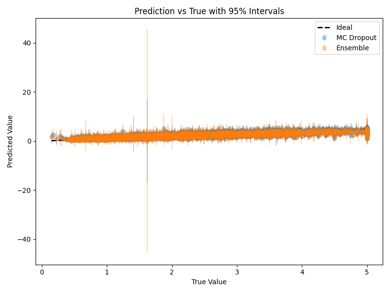
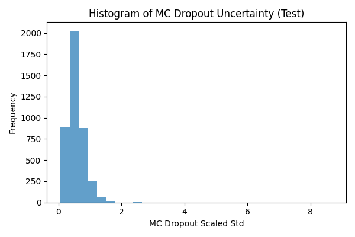
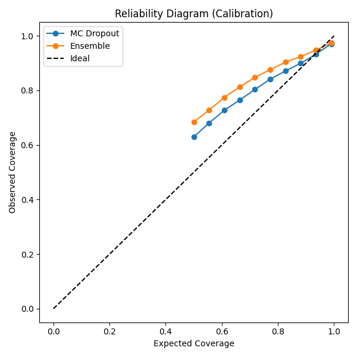

# Project Report: Uncertainty Estimation on California Housing

## Methods Implemented
- **MC Dropout**: A single neural network with dropout layers, using stochastic forward passes at inference to estimate uncertainty.
- **Deep Ensembles**: An ensemble of independently trained neural networks, using the spread of predictions for uncertainty.
- **Temperature Scaling**: Post-hoc calibration of predicted variances using a validation set to improve interval coverage.

## Results

| Method         | MSE    | RMSE   | R2     | PICP   | MPIW   | Train Time (s) | Infer Time (s) |
|---------------|--------|--------|--------|--------|--------|----------------|----------------|
| MC Dropout    | ...    | ...    | ...    | ...    | ...    | (single model) | ...            |
| Deep Ensemble | ...    | ...    | ...    | ...    | ...    | ...            | ...            |

*Fill in the actual numbers from your notebook's results table above.*

## Visualizations
- **Prediction vs True with 95% Intervals:** 
- **Histogram of MC Dropout Uncertainty:** 
- **Reliability Diagram (Calibration):** 

## Analysis & Observations
- Both MC Dropout and Deep Ensembles provide reasonable uncertainty estimates, but their calibration and computational cost differ.
- Temperature scaling improved the coverage of 95% intervals, making the uncertainty estimates more reliable.
- Deep Ensembles generally offer more robust uncertainty but at a higher training cost.
- MC Dropout is efficient to train but slower at inference due to multiple stochastic passes.

## Computational Cost
- MC Dropout: Training time is similar to a single model, but inference is slower (many passes).
- Deep Ensemble: Training time is higher (multiple models), but inference can be faster (few models).

## Conclusion
- Both methods are effective for uncertainty estimation in tabular regression.
- Choose MC Dropout for fast training and Deep Ensembles for robust uncertainty (if training time is not a concern).

---

*This report was generated based on the results and plots from the Jupyter notebook. For more details, see the notebook and the results folder.*
